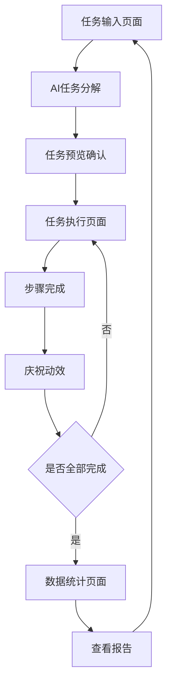

# 任务拆解小助手 - 产品需求文档

## 1. 产品概述

任务拆解小助手是一款基于AI的任务管理工具，通过自然语言处理将复杂任务智能拆解为可执行步骤，配合激励机制和数据可视化，帮助用户提升任务执行效率和完成动力。

- 核心价值：解决用户面对复杂任务时的拖延和执行困难问题，通过AI智能分解和正向激励机制提升任务完成率
- 目标用户：需要任务管理和执行激励的个人用户，特别是学生、职场人士和自由职业者
- 市场价值：打造个性化的AI任务助手，提升用户的工作学习效率和成就感

## 2. 核心功能

### 2.1 用户角色

本产品面向个人用户，无需复杂的角色区分，所有用户享有相同的功能权限。

### 2.2 功能模块

我们的任务拆解小助手包含以下主要页面：

1. **任务输入页面**：自然语言输入框、AI分解按钮、任务预览区域
2. **任务执行页面**：步骤列表、完成状态、庆祝动效、进度条
3. **数据统计页面**：任务完成图表、历史记录、成就展示、总结报告
4. **设置页面**：个人偏好、通知设置、数据导出

### 2.3 页面详情

| 页面名称 | 模块名称 | 功能描述 |
|---------|---------|----------|
| 任务输入页面 | 输入处理模块 | 接收自然语言描述，调用豆包AI进行任务分解，生成带鼓励话语的步骤列表 |
| 任务输入页面 | 任务预览模块 | 展示分解后的任务步骤，支持编辑和调整，确认后进入执行阶段 |
| 任务执行页面 | 步骤执行模块 | 显示当前任务步骤，提供完成标记，实时更新进度状态 |
| 任务执行页面 | 激励反馈模块 | 完成步骤时触发庆祝动效，显示鼓励文案，提升用户成就感 |
| 任务执行页面 | 进度跟踪模块 | 实时显示任务完成进度，剩余步骤提醒，预计完成时间 |
| 数据统计页面 | 数据可视化模块 | 展示多日任务完成情况的图表，包括完成率、用时统计等 |
| 数据统计页面 | 历史记录模块 | 查看历史任务详情，支持搜索和筛选，任务复用功能 |
| 数据统计页面 | 报告生成模块 | 自动生成周报月报，分析任务完成趋势，提供改进建议 |
| 设置页面 | 个人设置模块 | 配置个人偏好、通知提醒、界面主题等个性化选项 |

## 3. 核心流程

**主要用户操作流程：**

1. 用户在任务输入页面输入自然语言描述（如："我现在在家里看电影，等会要去图书馆学习"）
2. 系统调用豆包AI API进行任务分解，生成具体的执行步骤和鼓励话语
3. 用户在任务预览区域确认或调整分解后的步骤
4. 进入任务执行页面，逐步完成每个任务步骤
5. 完成步骤时触发庆祝动效和正向反馈
6. 任务全部完成后，数据自动记录到统计页面
7. 用户可在数据统计页面查看完成情况和生成的分析报告

## 4. 用户界面设计

### 4.1 设计风格

- **主色调**：温暖的橙色系（#FF6B35）作为主色，配合清新的绿色（#4ECDC4）作为辅助色
- **按钮风格**：圆角矩形按钮，具有轻微阴影效果，点击时有缩放动画
- **字体设计**：主标题使用18px粗体，正文使用14px常规字体，代码字体使用Monaco
- **布局风格**：卡片式布局，顶部导航栏，内容区域采用网格系统，留白充足
- **图标风格**：使用线性图标风格，配合适当的emoji表情增加亲和力

### 4.2 页面设计概览

| 页面名称 | 模块名称 | UI元素 |
|---------|---------|--------|
| 任务输入页面 | 输入处理模块 | 大型文本输入框，渐变背景，"开始分解"按钮采用主色调，加载动画使用旋转图标 |
| 任务输入页面 | 任务预览模块 | 卡片式步骤列表，每个步骤带有序号和鼓励文案，编辑按钮为铅笔图标 |
| 任务执行页面 | 步骤执行模块 | 进度条使用渐变色彩，当前步骤高亮显示，完成步骤显示绿色对勾 |
| 任务执行页面 | 激励反馈模块 | 粒子爆炸动效，彩色气球上升动画，"太棒了！"等鼓励文案弹窗 |
| 数据统计页面 | 数据可视化模块 | Chart.js图表库，柱状图和折线图结合，使用品牌色彩方案 |
| 数据统计页面 | 历史记录模块 | 时间轴布局，每日任务卡片，搜索框带有放大镜图标 |
| 设置页面 | 个人设置模块 | 开关按钮使用iOS风格，设置项采用列表布局，图标使用线性风格 |

### 4.3 响应式设计

产品采用移动优先的响应式设计策略，适配桌面端、平板和手机设备。在移动端优化触摸交互体验，按钮尺寸不小于44px，支持手势操作和触觉反馈。