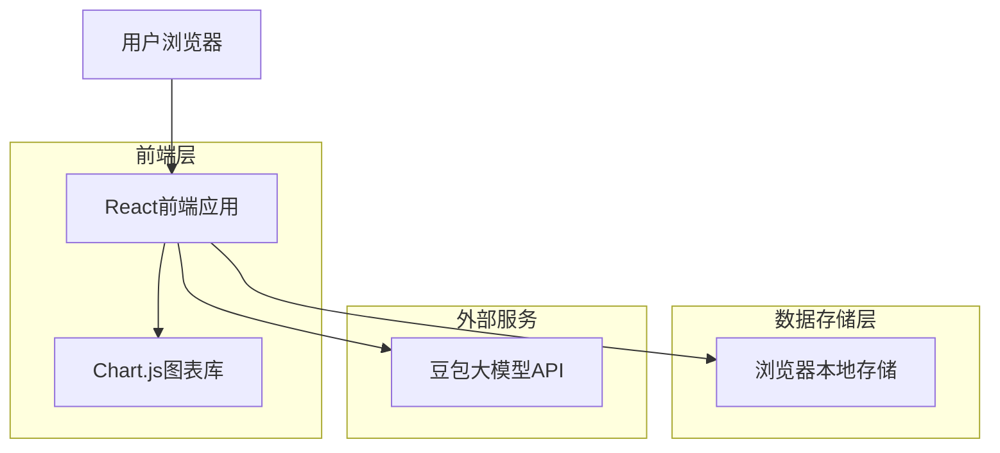
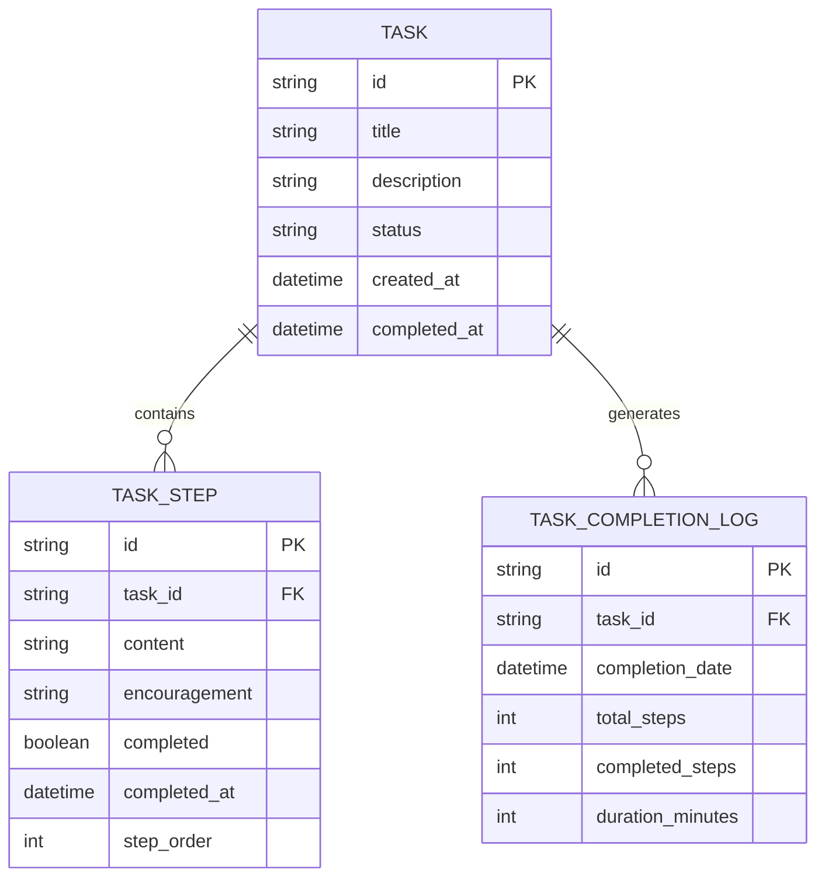

# 任务拆解小助手 - 技术架构文档

## 1. 架构设计



## 2. 技术描述

* 前端：React\@18 + TypeScript + Tailwind CSS + Vite

* 图表库：Chart.js\@4 + React-Chartjs-2

* 动画库：Framer Motion\@10

* 存储：浏览器 LocalStorage + IndexedDB

* AI服务：豆包大模型API (doubao-1-5-lite-32k-250115)

## 3. 路由定义

| 路由               | 用途                 |
| ---------------- | ------------------ |
| /                | 首页，任务输入和分解功能       |
| /execute/:taskId | 任务执行页面，显示步骤列表和完成状态 |
| /statistics      | 数据统计页面，展示任务完成情况和图表 |
| /settings        | 设置页面，个人偏好和系统配置     |

## 4. API定义

### 4.1 豆包大模型API集成

任务分解API调用

```
POST https://ark.cn-beijing.volces.com/api/v3/chat/completions
```

请求参数：

| 参数名称        | 参数类型      | 是否必需  | 描述                              |
| ----------- | --------- | ----- | ------------------------------- |
| model       | string    | true  | 模型名称：doubao-1-5-lite-32k-250115 |
| messages    | object\[] | true  | 对话消息列表                          |
| temperature | number    | false | 生成随机性控制，默认0.7                   |
| max\_tokens | number    | false | 最大生成token数，默认1000               |

响应参数：

| 参数名称                        | 参数类型      | 描述          |
| --------------------------- | --------- | ----------- |
| choices                     | object\[] | 生成的回复选项     |
| choices\[0].message.content | string    | AI生成的任务分解结果 |
| usage                       | object    | token使用情况统计 |

请求示例：

```json
{
  "model": "doubao-1-5-lite-32k-250115",
  "messages": [
    {
      "role": "system",
      "content": "你是一个专业的任务分解助手，请将用户的复杂任务分解为具体可执行的步骤，每个步骤都要配上积极鼓励的话语。"
    },
    {
      "role": "user",
      "content": "我现在在家里看电影，等会要去图书馆学习"
    }
  ],
  "temperature": 0.7,
  "max_tokens": 1000
}
```

### 4.2 本地API接口设计

任务管理相关接口（基于LocalStorage实现）：

```typescript
// 任务数据类型定义
interface Task {
  id: string;
  title: string;
  description: string;
  steps: TaskStep[];
  status: 'pending' | 'in_progress' | 'completed';
  createdAt: Date;
  completedAt?: Date;
}

interface TaskStep {
  id: string;
  content: string;
  encouragement: string;
  completed: boolean;
  completedAt?: Date;
}

// 统计数据类型
interface TaskStatistics {
  totalTasks: number;
  completedTasks: number;
  completionRate: number;
  averageStepsPerTask: number;
  dailyCompletions: Record<string, number>;
}
```

## 5. 数据模型

### 5.1 数据模型定义



### 5.2 本地存储数据结构

基于浏览器LocalStorage的数据存储方案：

```typescript
// 主要数据存储键名
const STORAGE_KEYS = {
  TASKS: 'ai_todo_tasks',
  SETTINGS: 'ai_todo_settings',
  STATISTICS: 'ai_todo_statistics',
  COMPLETION_LOGS: 'ai_todo_completion_logs'
};

// 任务数据存储
interface TaskStorage {
  tasks: Task[];
  lastUpdated: Date;
}

// 用户设置存储
interface SettingsStorage {
  theme: 'light' | 'dark';
  notifications: boolean;
  autoSave: boolean;
  celebrationEffects: boolean;
  apiKey?: string;
}

// 统计数据存储
interface StatisticsStorage {
  dailyStats: Record<string, {
    tasksCreated: number;
    tasksCompleted: number;
    stepsCompleted: number;
    totalTimeSpent: number;
  }>;
  weeklyStats: Record<string, {
    completionRate: number;
    averageTasksPerDay: number;
  }>;
  monthlyStats: Record<string, {
    totalTasks: number;
    completionTrend: number[];
  }>;
}

// 完成记录存储
interface CompletionLogStorage {
  logs: {
    id: string;
    taskId: string;
    completedAt: Date;
    duration: number;
    stepsCount: number;
    celebrationTriggered: boolean;
  }[];
}
```

## 6. 核心功能实现方案

### 6.1 AI任务分解实现

```typescript
// AI任务分解服务
class TaskDecompositionService {
  private apiKey = 'ee2322b1-8cb8-4c9d-8eb8-00e4dbc19487';
  private apiUrl = 'https://ark.cn-beijing.volces.com/api/v3/chat/completions';
  
  async decomposeTask(userInput: string): Promise<TaskStep[]> {
    const response = await fetch(this.apiUrl, {
      method: 'POST',
      headers: {
        'Content-Type': 'application/json',
        'Authorization': `Bearer ${this.apiKey}`
      },
      body: JSON.stringify({
        model: 'doubao-1-5-lite-32k-250115',
        messages: [
          {
            role: 'system',
            content: '你是一个专业的任务分解助手，请将用户的复杂任务分解为3-8个具体可执行的步骤，每个步骤都要配上积极鼓励的话语。返回JSON格式：{"steps": [{"content": "步骤内容", "encouragement": "鼓励话语"}]}'
          },
          {
            role: 'user',
            content: userInput
          }
        ],
        temperature: 0.7,
        max_tokens: 1000
      })
    });
    
    const data = await response.json();
    return this.parseAIResponse(data.choices[0].message.content);
  }
}
```

### 6.2 庆祝动效实现

```typescript
// 庆祝动效组件
const CelebrationEffect: React.FC = () => {
  return (
    <motion.div
      initial={{ scale: 0, opacity: 0 }}
      animate={{ scale: 1, opacity: 1 }}
      exit={{ scale: 0, opacity: 0 }}
      className="celebration-container"
    >
      <Confetti
        width={window.innerWidth}
        height={window.innerHeight}
        recycle={false}
        numberOfPieces={200}
        colors={['#FF6B35', '#4ECDC4', '#45B7D1', '#96CEB4']}
      />
      <motion.div
        initial={{ y: 50 }}
        animate={{ y: 0 }}
        className="celebration-message"
      >
        🎉 太棒了！又完成了一个步骤！
      </motion.div>
    </motion.div>
  );
};
```

### 6.3 数据可视化实现

```typescript
// 统计图表组件
const StatisticsChart: React.FC = () => {
  const chartData = {
    labels: ['周一', '周二', '周三', '周四', '周五', '周六', '周日'],
    datasets: [
      {
        label: '完成任务数',
        data: [3, 5, 2, 8, 4, 6, 7],
        backgroundColor: 'rgba(255, 107, 53, 0.6)',
        borderColor: '#FF6B35',
        borderWidth: 2
      }
    ]
  };
  
  return (
    <div className="chart-container">
      <Bar data={chartData} options={{
        responsive: true,
        plugins: {
          legend: {
            position: 'top' as const,
          },
          title: {
            display: true,
            text: '本周任务完成情况'
          }
        }
      }} />
    </div>
  );
};
```

